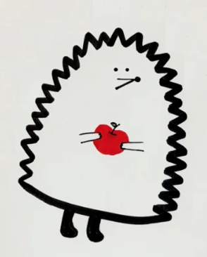
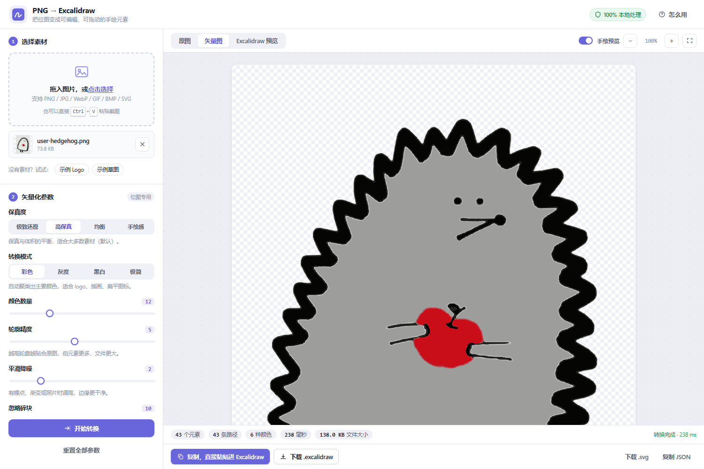
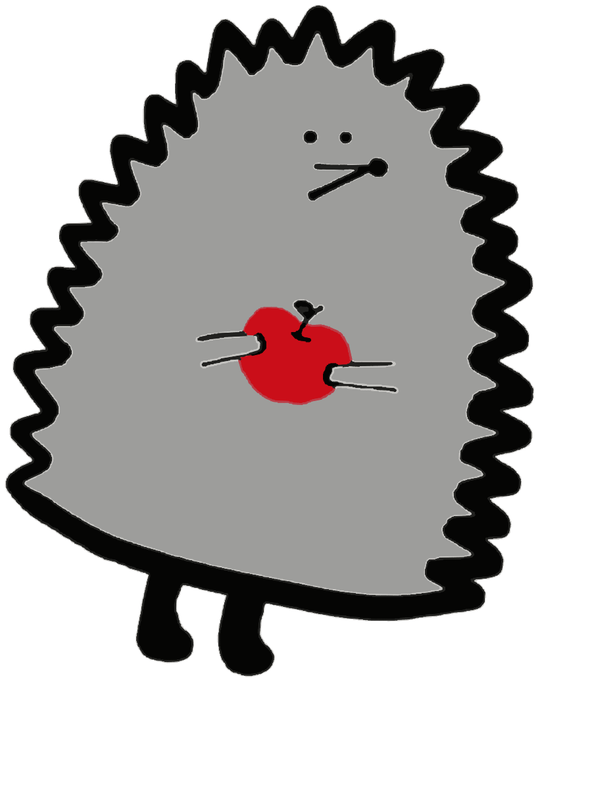

# PNG → Excalidraw 转换器

**在线使用** 👉 <https://blime4.github.io/png-to-excalidraw-converter/>

把位图（PNG / JPG / WebP / GIF / BMP）或 SVG 转成 **Excalidraw 原生元素**的纯前端工具。

生成的不是贴图，而是可以逐个选中、拖动、改色、重绘的闭合图形，可直接拖进 [excalidraw.com](https://excalidraw.com) 编辑。

参考 [png2svg.com](https://png2svg.com/zh/) 的矢量化思路 与
[svg-to-excalidraw-converter](https://shirokovroma.github.io/svg-to-excalidraw-converter/) 的元素映射思路实现。

**零构建、零后端、可离线**——所有计算在浏览器本地完成，图片不会离开你的电脑。

## 效果

一张手绘刺猬（原图 512×512），转出来 43 个元素、6 种颜色、耗时约 240ms：

| 原图 | 矢量化中间结果 | Excalidraw 元素 |
| --- | --- | --- |
|  |  |  |

> 第三张是**用 Excalidraw 官方渲染库 `exportToSvg` 渲染本项目的导出文件**得到的结果——也就是你在 excalidraw.com 里会看到的画面。锯齿轮廓、眼睛、鼻子、脚全部保留，没有白边光晕、没有抖动失真。

`docs/example-sketch.png` 是黑白线稿走「仅轮廓」形态的效果，`samples/` 里有可直接拖进 Excalidraw 的成品文件。

## 快速开始

**方式一（推荐）** —— 直接打开在线版，无需安装：
<https://blime4.github.io/png-to-excalidraw-converter/>

**方式二** —— 本地运行：

```bash
git clone https://github.com/blime4/png-to-excalidraw-converter.git
cd png-to-excalidraw-converter
# 直接双击 index.html 即可，或在项目根目录起个静态服务器
python -m http.server 5173
```

然后打开 `index.html`：

1. **选素材** —— 拖拽图片进页面，或点击上传，或截图后直接 `Ctrl+V` 粘贴
2. **调参数** —— 左侧「保真度」四档为先，需要时再动细节滑杆
3. **导出** —— 点「复制，直接粘贴进 Excalidraw」，到 excalidraw.com 按 `Ctrl+V`；或下载 `.excalidraw` 文件拖进画布

## 工作原理

两条输入链路，共用同一套 Excalidraw 元素内核：

```
接入 A：位图 ──自研矢量化──► 多边形集合 ─┐
                                            ├─► Excalidraw v2 元素 ─► .excalidraw / 剪贴板
接入 B：SVG  ──路径解析────► 多边形集合 ─┘
```

### 接入 A：位图矢量化（自研管线）

不经过「先生成 SVG 字符串再解析」的中间格式，那会丢失信息并引入抗锯齿光晕层。实际步骤：

1. **预处理** —— 缩放到目标精度（小图会放大到 2000px 再追踪，避免细节丢失）、可选灰度化、大津法（Otsu）自动二值化、alpha 与背景色合成
2. **调色板聚类** —— 最远点采样初始化 + Lloyd 迭代的 K-means，把几万种颜色压到几十种主色
3. **降噪** —— 可分离盒式模糊
4. **逐像素量化** —— 每个像素归到最近的调色板色，同时统计边框一圈的颜色分布（判定背景用）
5. **抗锯齿混合像素拆分** —— 若某个调色板色正好落在另外两色的连线上（混合比例 0.2~0.8），说明它是边缘过渡色而非真实颜色：把这些像素直接拆回两侧的实体颜色。**这是消除白边光晕的根，也是细线不再劈叉成两条的原因。**
6. **并查集合并** —— 相近色合并为一类；与自动识别出的背景色相近的颜色并入背景
7. **区域边界追踪** —— 有向边拼接法：每个像素的边生成有向边，把区域放在行进方向左侧，沿线走出闭合环。相邻区域共享同一份角点坐标，因此**铺贴无缝、不会出现缝隙或叠色**。能正确处理 4 连通的实体与 8 连通的孔洞。
8. **孔洞处理** —— 检测到孔洞时，采样孔洞内部实际「透出」的颜色（取孔洞边界内侧像素众数，排除父区域），补一块该颜色的图形叠上去。圆环不会被填成实心。
9. **保形抽稀** —— Ramer–Douglas–Peucker 简化点列，容差随保真度档位自适应
10. **元素翻译** —— 每个环变成一条带 `polygon: true` 的闭合 `line` 元素，连同颜色、线宽、roughness、opacity 一起写出

### 接入 B：SVG → Excalidraw

直接解析 SVG DOM（矩阵变换、path 指令全支持），按图形语义映射到最合适的 Excalidraw 元素：

| SVG | 映射为 |
| --- | --- |
| `rect` `circle` `ellipse`（轴对齐） | 原生 `rectangle` / `ellipse` |
| `rect` 带旋转 / 斜切 | 退化为闭合 `line` 多边形 |
| `line` `polyline` | `line` 元素 |
| `polygon` `path`（M/L/H/V/C/S/Q/T/A/Z 及相对坐标） | 闭合/开放的 `line` 元素，弧长自适应重采样 |
| `text` / `tspan` | Excalidraw 文本元素 |
| `<g>` | 保留为 `groupIds` |

`transform`（matrix / translate / scale / rotate / skewX / skewY，含嵌套）、`<use>` 引用、渐变（取 stop 均值近似为纯色）、`fill-opacity` / `stroke-opacity` / `<g> opacity` 均已支持；`<image>`、滤镜、裁剪路径、遮罩会跳过并给出提示。

## 保真度档位

一次控制两段转换的精度取舍：

| 档位 | 处理尺寸 | 轮廓精度 | 抽稀 | 相近色合并阈值 | 手绘抖动 | 适用 |
| --- | --- | --- | --- | --- | --- | --- |
| 极致还原 | 2400px | 最高 | 无 | 26 | 无 | 要求逐像素贴合，元素较多 |
| **高保真**（默认） | 2000px | 高 | 轻 | 32 | 无 | 大多数素材 |
| 均衡 | 1400px | 中 | 中 | 42 | 有 | 更快、元素更少 |
| 手绘感 | 更低 | 中 | 强 | 更宽 | 强 | 追求草稿感 |

档位只设默认值，切换后仍可单独微调下方滑杆。

## 界面参数

| 参数 | 说明 |
| --- | --- |
| 保真度 | 见上表 |
| 转换模式 | 彩色 / 灰度 / 黑白（大津法自动阈值）/ 极简 |
| 颜色数量 | 调色板主色数。越低元素越少 |
| 轮廓精度 | 边界采样密度。越高越贴合原图，元素也越多 |
| 平滑降噪 | 追踪前的模糊强度。有噪点、渐变或照片时调高，边缘更干净 |
| 忽略碎块 | 丢弃小于该尺寸的杂色小块，能显著减少元素数量 |
| 剔除背景 | 自动识别边框主色为背景并去掉。识别不到会提示而不误删 |
| 元素形态 | 实心色块 / 色块+描边 / 仅轮廓（线稿感） |
| 填充纹理 | 实心 / 斜线 / 交叉 / 锯齿（Excalidraw 原生 hatch） |
| 手绘强度 | 精准 / 手绘 / 潦草，对应 Excalidraw 的 `roughness` |
| 线条粗细 | 细 / 中 / 粗 |
| 不透明度 | 0~100% |
| 输出尺寸 | 整体缩放倍率 |
| 元素数量上限 | 超出时丢弃面积最小的图形，保证 Excalidraw 流畅 |

## 导出方式

- **复制粘贴** —— 写出 `excalidraw/clipboard` 格式，到 excalidraw.com 按 `Ctrl+V` 即得原生元素
- **文件导入** —— 下载 `.excalidraw`（Excalidraw v2 格式），拖进画布
- **中间产物** —— 可单独下载矢量化得到的 SVG 或原始 JSON

## 目录结构

```
index.html                       单页应用入口
assets/css/style.css             样式
assets/js/excalidraw-core.js     转换内核（SVG/多边形 → Excalidraw 元素，可独立复用）
assets/js/preview.js             rough.js 手绘预览渲染器
assets/js/app.js                 位图矢量化管线 + 界面主流程
assets/js/vendor/rough.js        手绘渲染（MIT）
assets/fonts/Virgil.woff2        Excalidraw 手写字体
samples/                         可直接拖进 Excalidraw 的示例成品
docs/                            效果截图
_dev/                            开发期自测脚本（需本机 Chrome + puppeteer-core）
```

## 复用内核

`excalidraw-core.js` 不依赖界面，可单独拿去转换任意 SVG 或点列：

```html
<script src="assets/js/excalidraw-core.js"></script>
<script>
  // SVG → 元素
  const { elements, warnings } = ExcalidrawCore.svgToElements(svgString, {
    styleMode: 'fill',     // fill | both | stroke
    fillStyle: 'solid',    // solid | hachure | cross-hatch | zigzag
    roughness: 1,          // 0 精准 / 1 手绘 / 2 潦草
    strokeWidth: 2,
    opacity: 1,            // 0~1
    scale: 1,
    maxElements: 3000,
    grouping: true,
    curveDetail: 5         // 1~10，曲线采样密度
  });

  const file = ExcalidrawCore.buildFile(elements);        // .excalidraw 文件对象
  const clip = ExcalidrawCore.buildClipboard(elements);    // 可直接 Ctrl+V 的剪贴板对象
</script>
```

底层能力单独导出，可自建管线：

| API | 用途 |
| --- | --- |
| `traceRegions(pixels, labels, w, h)` | 有向边拼接的区域边界追踪，输出带孔洞层级的闭合环 |
| `shapesToElements(shapes, opts)` | 多边形集合 → Excalidraw 元素 |
| `shapesToSvg(shapes, w, h)` | 多边形集合 → SVG 字符串 |
| `sampleSegments(segments, unit, eps)` | 直线/二次贝塞尔段 → 自适应采样点列 |
| `rdp(points, tol)` | 保形抽稀 |
| `toHex` / `hexToRgb` / `rgbToHex` | 颜色工具 |

## 测试与验证

`_dev/` 下是开发期自测脚本，用本机 Chrome（puppeteer-core）跑真实浏览器全流程：

| 脚本 | 用途 |
| --- | --- |
| `test.js` | 30+ 项断言：SVG → 元素映射、transform、渐变、分组、边界情况、导出格式 |
| `hedgehog.js` | 端到端：真实图片 → 矢量化 → 元素 → 三视图截图 + 导出 |
| `render-official.js` | 用 **Excalidraw 官方渲染库** 渲染导出文件，验证在真实 Excalidraw 中的效果 |
| `order-inspect.js` | 分析元素叠放顺序（fractional index） |
| `diag2.js` | 管线诊断：计数区域、标签分布，定位追踪异常 |
| `fidelity.js` / `timing.js` | 保真度对照与耗时测量 |

运行（需先在项目根目录起静态服务器）：

```bash
NODE_PATH=<puppeteer-core 所在目录> node _dev/hedgehog.js
```

验证结论（真实浏览器实测）：

- 刺猬手绘图：43 个元素、6 种颜色、约 240ms、零 JS 报错，导出 141KB
- 导出文件经 **Excalidraw 官方库** 逐元素校验并渲染，`type/version/source/appState/files` 字段齐全，`line.points` 相对 bbox 非负且与 `width`/`height` 严格一致，`index` 为定长 base62 保证字典序等于生成序
- 元素叠放顺序与生成顺序一致，小细节元素位于上层，不会被大面积色块盖住

## 已知限制

- 照片类素材天然不适合矢量化，logo / 图标 / 线稿 / 扁平插画效果最好
- Excalidraw 的闭合线条不支持真正的镂空（even-odd），图像中的「洞」是通过叠加一块「透出颜色」的图形来近似还原的
- 元素数量过大时 Excalidraw 会变卡，用「元素数量上限」和「颜色数量」控制

## 第三方

- [rough.js](https://github.com/rough-stuff/rough) — MIT，手绘渲染
- Virgil 字体 — Excalidraw 项目，OFL
